# phpo

[中文](./README.md) · [English](./README_EN.md)

> 面向 PHP 开发者的本地 Docker 开发环境管理器。三平台桌面应用，**只有图形界面，没有命令行**。
>
> 最新版本：**0.1.42** · 下载：https://github.com/xiaokentrl/phpo/releases/latest
> 项目规则的唯一权威是 [AGENTS.md](./AGENTS.md)（中文，冻结文档），本文为「读懂并使用这个项目」的入口。**想看英文版，点上面的 English，或直取 [README_EN.md](./README_EN.md)；`docs/` 下的 32 篇文档只有中文。**

---

## 1. 这东西是干什么的

你写 PHP，手上同时有三五个项目：一个 WordPress 要 PHP 7.4，一个 Laravel 要 PHP 8.3，还有个老客户站要 MySQL 5.7 而新项目用 8.4。传统做法是装一个 PHP、改配置、再装一个、再改回来，或者去手写 docker-compose 文件。

phpo 干的事：**把「装环境」变成点几下按钮**。

- PHP、MySQL、PostgreSQL、Redis、Nginx 各版本**同时装着、同时跑着**，互不打架，每个都是一只容器（名字统一 `phpo-{服务}-{版本}`）。
- 站点想换 PHP 版本，在下拉框里选一下就行，nginx 的上游立刻精确指到 `php-{版本}-fpm:9000`。
- 想试就装，不想要就卸，卸了数据卷还留着，重装回来数据在。
- 断网、内网、公司不给访问 Docker Hub —— 装过的东西都在本地缓存里，能零网络重装。

一句话：**它不是又一个 PHP 集成环境，它是帮你把 Docker 那层藏起来的工具，但藏得住、也掀得开**（每一步行是什么都在日志抽屉里逐行写着，不糊弄）。

### 和同类产品的差别在哪

| 别人 | phpo |
|------|------|
| 一个 PHP 版本切来切去 | 多版本真并存，每版本一套自己的配置、日志、扩展 |
| 帮你下镜像，每次都要联网 | **先查本地缓存**；缓存没有再看本机 Docker 里有没有；都没有才联网。装过一次就落地缓存 |
| 只缓存「镜像」 | 连扩展的**包文件本体**（pecl 的 `.tgz`、Alpine 的 `.apk`）也缓存，换机断网时编扩展也不用联网 |
| 装扩展要么没有、要么给你一个输入框 | 每个 PHP 版本一份**全量扩展目录（73 项 / 8 组）**，常用 11 项自动勾好，编译过程逐行直播，失败点名是哪个扩展 |
| 出错只说「失败」 | 出错带原因、带容器日志尾部，告诉你该怎么回来 |
| 各种「为了你好」的限制 | **只有 8 条硬红线**，其余一律放行或降级为警告。密码可以留空、版本随便填、路径可以出站点根、PHP 可以全卸光 |
| 备份一个文件读不动就整包失败 | 读不动的跳过并聚合告警；数据库另外做逻辑导出（`mysqldump` / `pg_dumpall` / redis rdb）兜住 |

---

## 2. 界面一览（按开发者关心的程度排）

不想读长文的，看这 12 张就够了。顺序是我猜的「你心里想知道的先后」：**先确认多版本真能并存，再看站点和 nginx 配置能不能自己插手，然后才轮到扩展、日志、备份，最后才是外观。**

> 截图取自当前生产构建的前端产物，跑在**无后端演示通道**下（列表里的站点、服务、归档都是演示种子，不是真机数据）。原生窗口里的点击级走查还欠着，见下文「还没做到的事」。离线缓存那一屏没截——演示通道拿不到真实条目，我不编数据；它的能力在下面的差别表和「联网行为」一节里写着。

### ① 总览：几套环境在跑，一眼看完

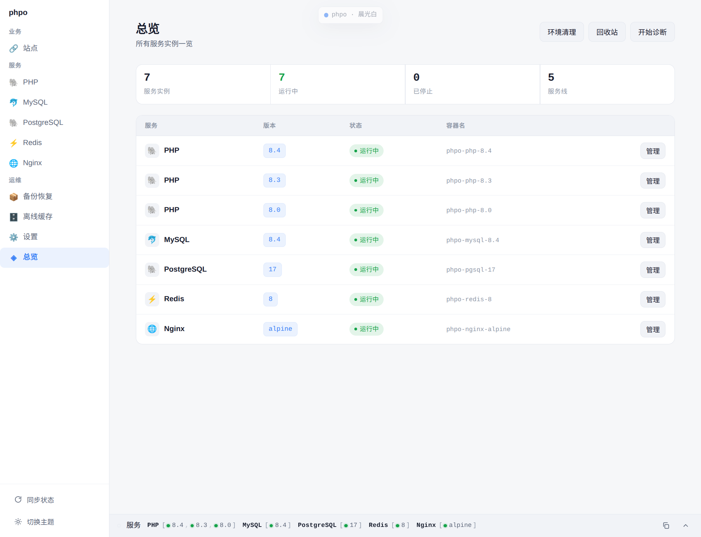

顶部四个数（服务实例 / 运行中 / 已停止 / 服务线）＋逐行表格：PHP 8.4、8.3、8.0 与 MySQL 8.4、PostgreSQL 17、Redis 8、Nginx alpine **同时装着同时跑着**，每行给服务、版本、状态、容器名（`phpo-php-8.4` 这种统一前缀）和一颗「管理」入口。右上角三颗按钮是环境清理、回收站、开始诊断——后者在真实宿主上跑 15 项环境体检（Docker、端口、目录可写、hosts 权限、缓存完整性、临时目录残留……），能一键修的直接给按钮。

### ② PHP 服务页：三个版本并排，各管各的

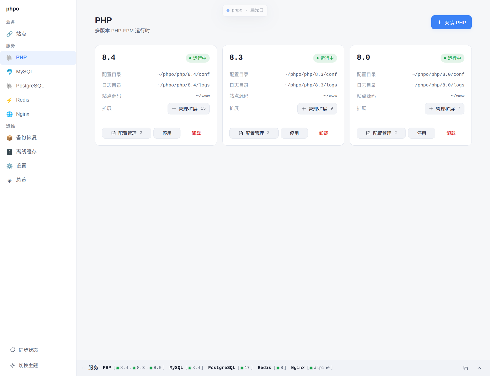

这是这软件存在的第一理由。三个 PHP 卡片并排，各自的配置目录 / 日志目录 / 站点源码路径、已启用扩展数（15 / 9 / 7），以及配置管理 / 停用 / 卸载三颗按钮互不牵连。切换某站点的 PHP 版本就是精确指向那只容器的 `php-{版本}-fpm:9000`，不做模糊匹配。

### ③ 站点列表：端口、PHP 版本、健康态，行内就能改

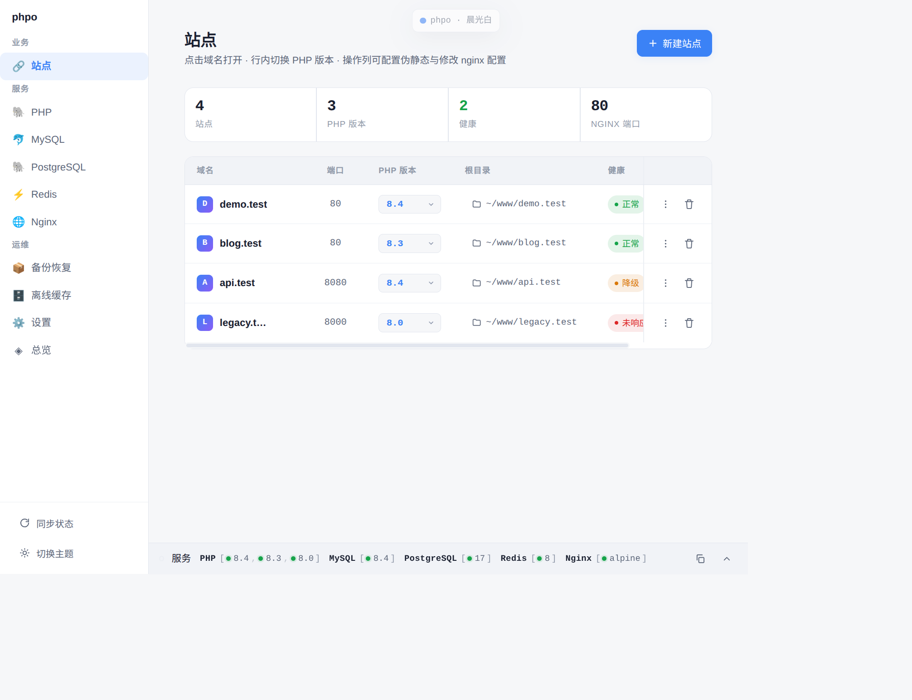

顶部四张统计卡（4 站点 / 3 个 PHP 版本 / 2 健康 / nginx 端口 80），表里逐行给域名、端口、PHP 版本（**行内下拉直接切**）、根目录、健康态、操作列（⋮ 菜单与删除，表可横向滚到 hosts 列）。注意 `api.test` 那颗橙色「降级」：它建的时候端口被占，phpo **不擅自改你填的端口**，站点照常建、vhost 暂不落盘，腾出端口或改一次端口即自愈。切 PHP 版本会先 `nginx -t` 才落盘重载；hosts 未解析就点「加 hosts」（会提权，被拒也只给你一行手抄，不伤站点）。

### ④ vhost 正文：nginx 配置直接给你改，落盘前先 `nginx -t`

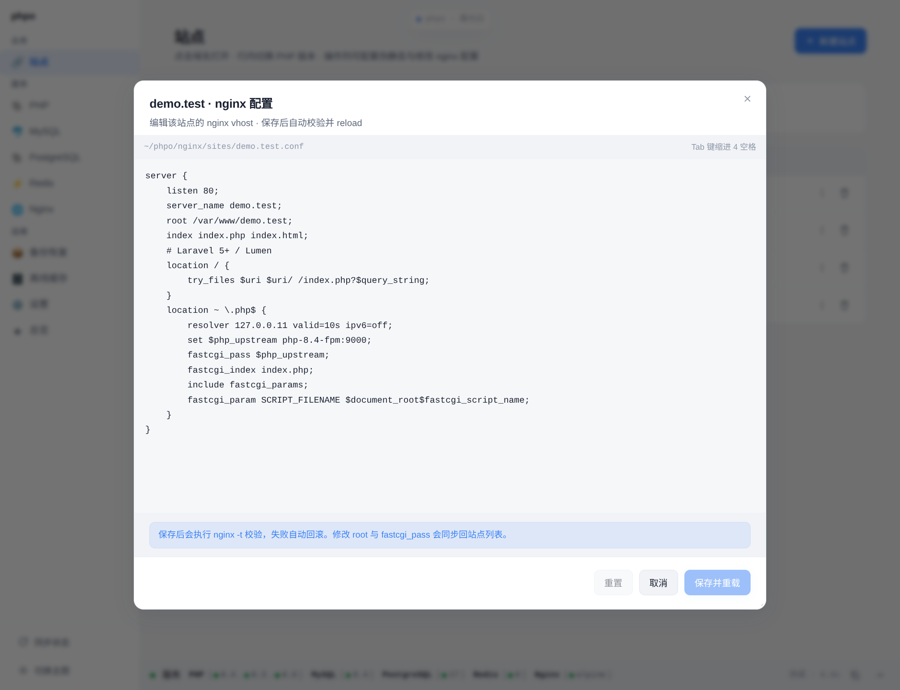

「藏得住也掀得开」的这一面。工作目录（默认 `~/phpo`）下 `nginx/sites/demo.test.conf` 的裸文本，`set $php_upstream php-8.4-fpm:9000;` 看得见摸得着；`proxy_pass`、`ssl_certificate`、`load_module` 都不拦。**唯一硬要求**：保存前必须 `nginx -t` 过，不过就自动回滚——不会让你把 nginx 写死。

### ⑤ 伪静态：9 种框架预设，中文生态那几个也在

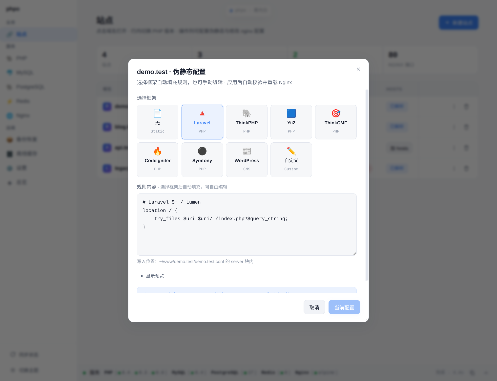

Laravel / ThinkPHP / Yii2 / ThinkCMF / CodeIgniter / Symfony / WordPress / 无 / 自定义。点一下写进 vhost 的对应位置，规则原文可预览；选「自定义」直接贴自己的。

### ⑥ 装 PHP 时就把扩展选好：73 项全量目录，常用 11 项已勾

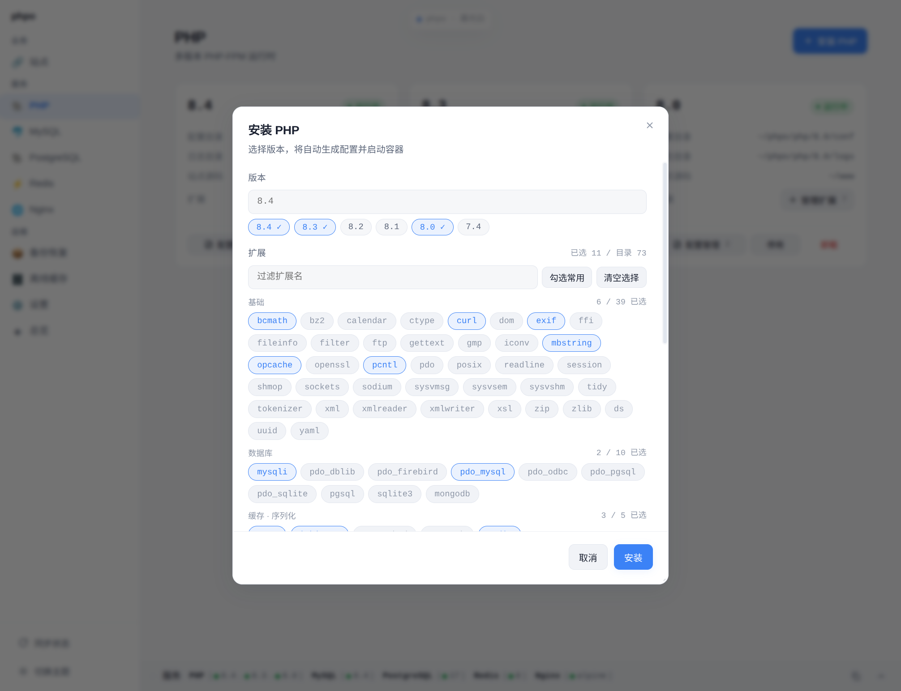

不是给你个输入框让你猜。每个 PHP 版本一份 73 项 / 8 组的目录（按版本可见性过滤），Laravel 要的那几项默认就是勾上的。目录**不是白名单**——手输一个目录外的扩展名，过了格式校验照样装。

### ⑦ 管理扩展：提交的永远是完整目标集，编译过程逐行直播

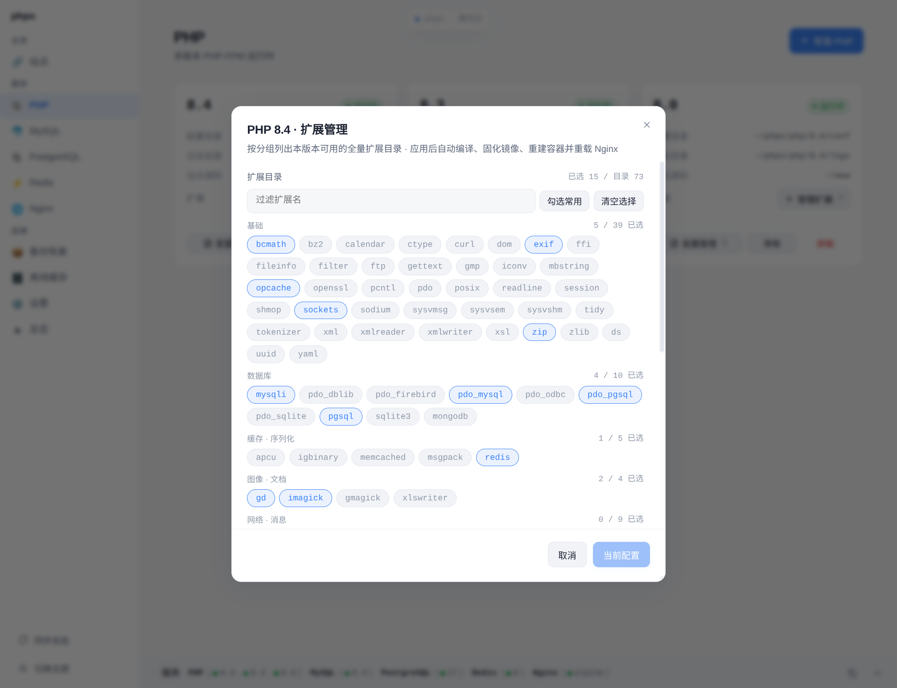

弹窗默认勾选＝这个版本当前**已应用**的扩展（取后端权威快照，不是空清单）。改一项就重编译 + 固化镜像 + 重建容器；pecl 与 Alpine 构建依赖的**包文件本体**会落进离线缓存，换机断网也能编。某个扩展编译失败会点名是哪个，并把整单退回原镜像。

### ⑧ 日志抽屉：每一步在干什么、卡在哪，逐行写给你看

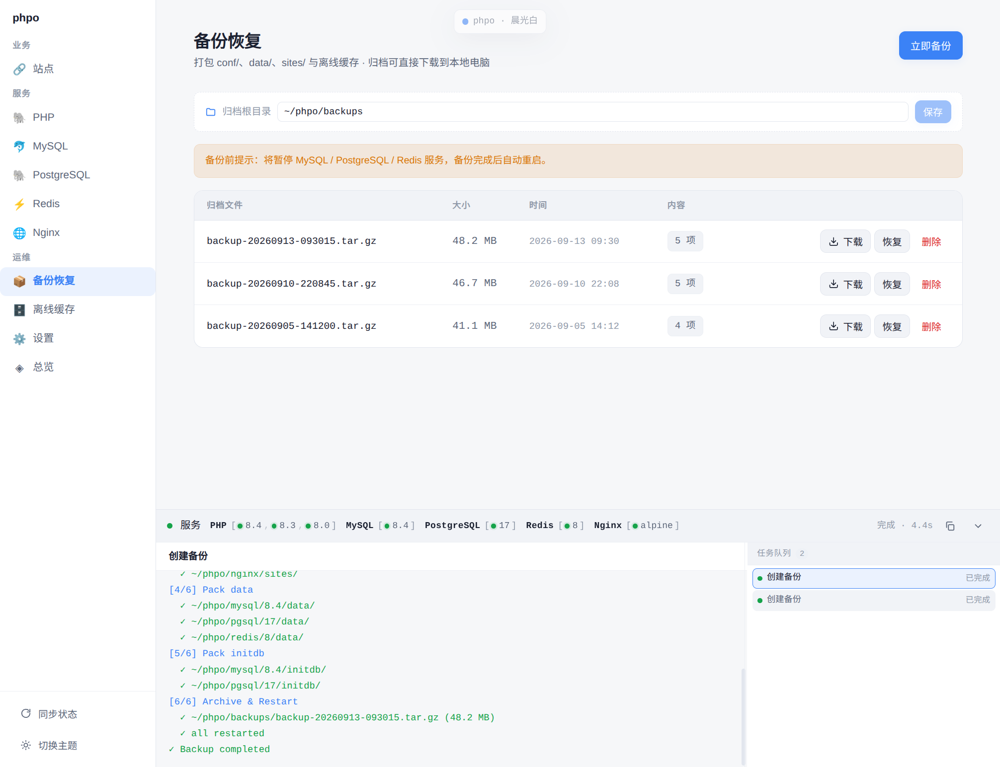

全项目的核心，不是附属品。左 70% / 右 30%（中缝可拖，双击复位）：左栏顶部是人话名字（「创建备份」），下面 `[4/6] Pack data` 一路到 `Backup completed`；右栏队列最新提交置顶，标「等待中 / 执行中 / 已完成」。规矩是硬的——**后端是唯一权威，界面不假装成功**，所以那颗按钮会先灰着，等状态真回来才亮。

### ⑨ 数据库服务卡：端口、密码、数据目录都摊在脸上

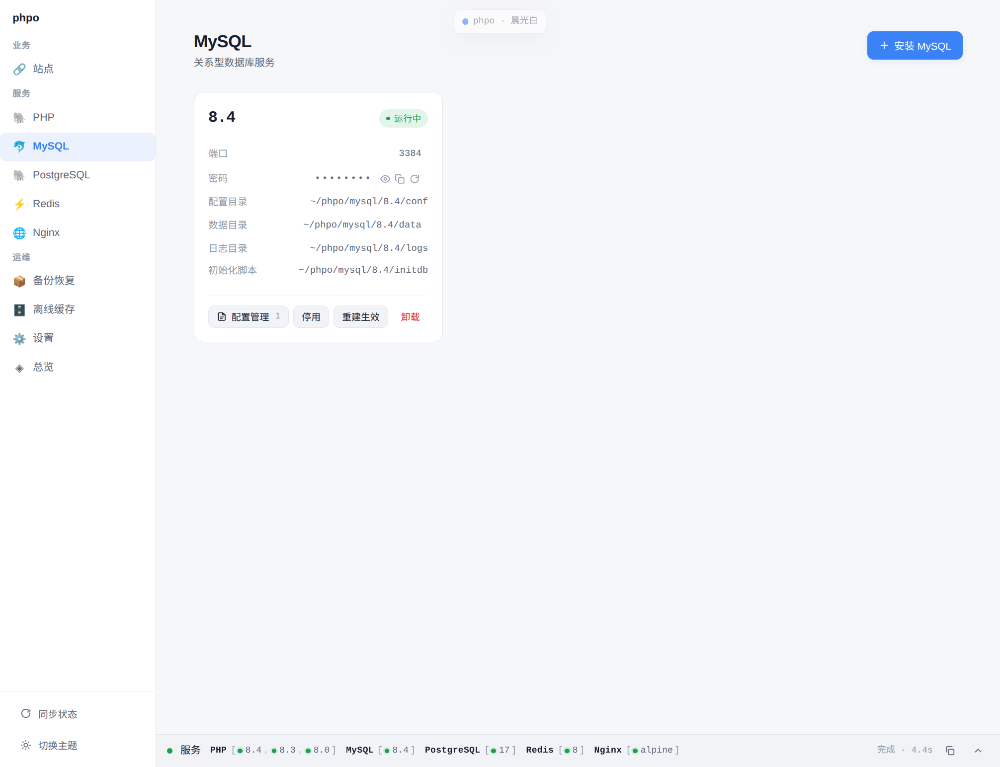

MySQL 8.4：端口 3384、密码 👁 可看 📋 可复制 ↺ 可重置，配置目录 / 数据目录 / 日志目录 / 初始化脚本逐条列出（数据目录还能每个版本单独自定义到任意路径）。密码**明文存、可以留空、长度不校验**——这是刻意的策略，不是没做加密。改完密码或端口不会立刻生效（那是建容器那一刻定死的），点卡片上的「重建生效」，**数据卷保留、不会丢库**。

### ⑩ 备份：一键打包，读不动的文件不判死整包

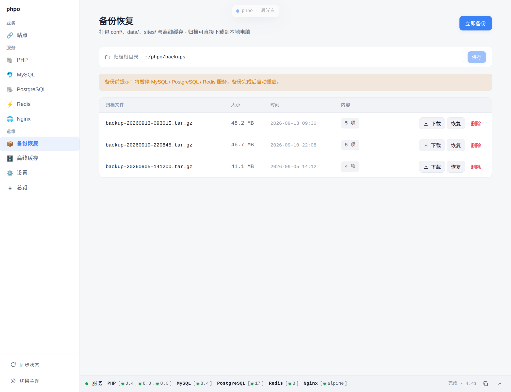

先逻辑导出（`mysqldump` / `pg_dumpall` / redis `--rdb`）→ 暂停服务 → 快照配置 → 打包 → 自动重启。数据目录里容器 uid 写的文件宿主读不动，那些**跳过并聚合告警**，整包照常出。顶部那行「归档根目录」可直接改到任意文件夹（默认 `~/phpo/backups`）；列表给体积、时间与条目数，行内下载 / 恢复 / 删除。

### ⑪ 警告代替阻止：停一个 PHP 之前，说清谁在用它

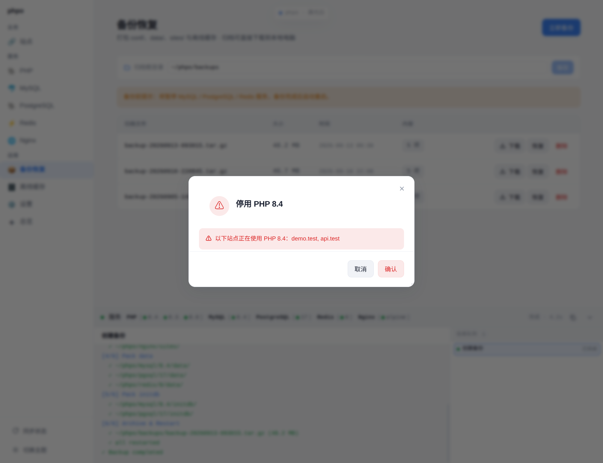

除 8 条硬红线外，能警告的绝不拦你：这里明说「以下站点正在使用 PHP 8.4：demo.test、api.test」，然后照常执行。卸载同理不设「至少保留一个版本」的门禁——你是程序员，这个决定归你。

### ⑫ 设置：主题、语言、缩放、托盘

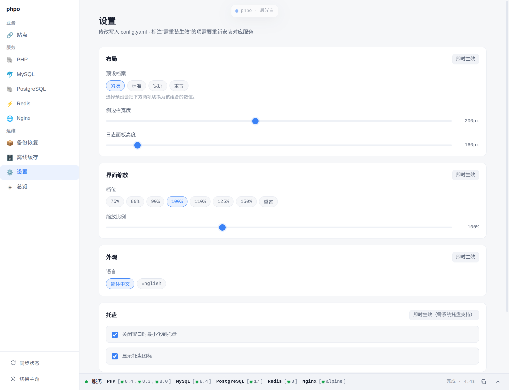

权重最低，放最后。四张卡各管一件事：**布局**（紧凑／标准／宽屏三档预设 + 侧边栏宽度 + 日志面板高度）、**界面缩放**（75%–150% 共 7 档，另有连续滑杆）、**外观**（简体中文／English）、**托盘**（关窗最小化、显示托盘图标两枚开关）；再往下是「检查更新」。6 套主题不在这屏上选，走标题栏那颗「phpo · 晨光白」或侧栏底部的「切换主题」。这些偏好**只写前端本地存储**，不进配置文件、不进数据库（页眉那句「修改写入 config.yaml」是原型遗留文案，写 `config.yaml` 的密码与端口在服务卡片上改，不在这里）。

---

## 3. 装它之前要先有的东西

- **Docker 必须在跑**：Windows/macOS 装 Docker Desktop；Linux 装原生 Docker Engine。Docker 不可用则启不了服务（这是硬红线之一）。
- **Linux 上多一步**：`sudo apt install docker.io` 装完，还要 `sudo usermod -aG docker $USER`，然后**重新登录**（只开个新终端不够）。没做这步的话 socket 在盘上、daemon 在跑，但 phpo 拨不动它——它会明说「当前用户无权访问 Docker」，不会骗你说「Docker 没运行」。
- 只有 Docker SDK 这条路：phpo 不去 shell 调 `docker` 命令，所以「终端里 docker 能用」不等于「phpo 能用」，判据不一样。
- 端口 80 最好空着（站点默认端口）。被占了也不会失败，只是那一站先建成分级「降级」状态。

---

## 4. 下载与安装

去 https://github.com/xiaokentrl/phpo/releases/latest ，按系统取一颗：

| 系统 | 文件 | 备注 |
|------|------|------|
| Windows | `phpo-setup-x64.exe` | NSIS 安装包 |
| macOS | `phpo.dmg` | **ad-hoc 签名，还没接正式 Developer ID 与公证**，第一次打开要在「系统设置 → 隐私与安全性」里允许 |
| Linux (deb) | `phpo_0.1.42_amd64.deb` | Debian / Ubuntu |
| Linux (rpm) | `phpo-0.1.42.x86_64.rpm` | RHEL / Fedora 系 |

旁边还有：`checksums.txt`（各包 SHA256）、四份 `.sig`（Ed25519 签名，恒 88 字节）、`manifest.json`（应用内升级用的发布清单）。

每个包的签名怎么自己验，见 [docs/打包发布.md](./docs/打包发布.md)。

**首次启动会进装机向导**，让你定两个目录（都能选任意位置）：

- 工作目录根（PHPO_HOME，默认 `~/phpo`）——各服务的配置、日志、数据、离线缓存都落在这里。
- 站点根（WWW_ROOT，默认 `~/www`）——每个站点一个子目录。

向导里的「验证」是**纯只读预检**：只看目录在不在、上级能不能写，不会建任何东西。只有点「确认并创建」才真正落盘。这一点是设计上的硬要求，不是客套。

> 本文接下来的 `./` 一律指上面那个工作目录根，不是仓库根。它默认为 `~/phpo`，但你改了就跟 `~` 没关系了。

---

## 5. 十分钟跑起来

1. 打开 phpo，走完向导。
2. 「PHP」页 → 点「安装」→ 版本填 `8.3` → 扩展目录里常用 11 项已经帮你勾好，不放心就扫一眼 → 确认。
   日志抽屉（底部）会实时滚出：查了缓存没有、拉了镜像、建了容器、编了哪几个扩展、固化成新镜像。
3. 「Nginx」页 → 装一个（Nginx 是单例，只能装一个）。
4. 「站点」页 → 添加站点 → 域名填 `demo.test`、选刚才那个 PHP、端口留默认 80、根目录指到你项目。
5. 浏览器开 `http://demo.test`。域名解析那行如果显示「未解析」，点「加 hosts」（会提权，被拒也不会伤站点，只给你一行手抄）。
6. 换个项目要 PHP 7.4？回「PHP」页再装一个 7.4，站点行里下拉一切，`nginx -t` 过了才落盘重载。

要数据库就去「MySQL / PostgreSQL / Redis」页装，密码框默认 `123456`，**可以清空、可以随便长**，👁 能看、📋 能复制。改完密码或端口不会立刻生效——那是建容器那一刻定死的东西，点卡片上的「**重建生效**」（数据卷保留，不会丢库）。

---

## 6. 界面都有什么

左侧栏 10 个入口（站点 + 五个服务页 + 总览 + 备份 + 离线缓存 + 设置；五个服务页共用同一个基座组件）。算上「清理」面板的话是 11 个界面——它是从总览页的按钮打开的弹窗，不是独立路由。目录里的视图文件有 12 个（其中一个是被复用的基座，一个是清理面板的主体）。

| 页面 | 干什么 |
|------|--------|
| 总览 | 一眼看全局 + **环境体检**（15 项：Docker、端口、目录可写、hosts 权限、网络、缓存完整性、临时目录残留……能一键修的先给你按钮，不能修的只是警告） |
| 站点 | 建站、删站、改端口、切 PHP、伪静态（9 种预设）、手改 vhost 正文 |
| PHP / MySQL / PgSQL / Redis / Nginx | 五个服务各自的安装、启停、重建、卸载、配置、密码、端口、数据目录 |
| 备份 | 一键打包（先逻辑导出数据库 → 暂停 → 快照 → 打包 → 自动重启）、下载、恢复、删除 |
| 离线缓存 | 看占用与条目、全部校验、三种模式清理、**手工导入**单个包文件、改缓存根 |
| 清理 | 扫孤儿容器/卷/网络/镜像，三模式清理（保守 / 标准 / 激进）+ 回收站 |
| 设置 | 布局（侧边栏宽度、日志面板高度）、界面缩放、语言、托盘偏好、**Docker 镜像源**（多源 · 检测排序）、检查更新 |

**底部日志抽屉是全项目的核心，不是附属品。** 它是左右两栏（默认 70% / 30%，中缝可以拖，40–80% 之间夹取，双击复位）：

- 左栏：当前这件事的**人话名字**（「创建备份」「停用 PHP 8.4」）+ 每一步的实时日志 + 失败原因。没有任务在跑时，这里滚的是系统事件流水（缓存命中、状态漂移、发现新版本，最近 200 行）。
- 右栏：任务队列。最新提交的永远在最上面，每行标「等待中 / 执行中 / 已完成」（失败、取消也如实标）。排队中的可以撤回。

规矩是硬的：**后端是唯一权威，界面不做假装成功的乐观更新**。所以你会看到「点了按钮那一颗先灰掉，等状态真回来了再亮」，而不是转个圈就当好了。同页面其他按钮照常能点——并发写操作是按 FIFO 排队的，这是合法路径，不拦你。

界面上**不会出现任何 `phpo …` 形态的伪命令行**：这产品没有 CLI，摆一行看着能敲的东西只是骗你。

---

## 7. 东西放在哪儿

| 内容 | 位置 |
|------|------|
| `config.yaml`（路径、密码、端口、数据目录、发布源、Docker 镜像源） | 系统应用数据目录里的 `phpo/`：Linux `~/.config/phpo/`，macOS `~/Library/Application Support/phpo/`，Windows `%APPDATA%\phpo\` |
| `phpo.db`（只存运行态）、审计日志、回收站（7 天）、升级工作区 | 同上 |
| 各服务的配置/日志/数据、离线缓存（默认 `./offline/`）、备份归档（默认 `./backups/`） | 工作目录根 `./`（默认 `~/phpo`，向导可改到任意目录） |
| 站点目录 | 站点根（默认 `~/www`） |
| 主题、语言、界面缩放、抽屉比例 | 浏览器本地存储，不进配置、不进数据库 |

三个可以**再单独自定义**的路径：离线缓存根、备份根、每个数据库版本的数据目录。规则是**互斥唯一**——你自定义了，默认那份就彻底不用了，不会两处并存、也不会读一处写另一处；清空即回默认。唯一校验是路径安全（防穿越），不要求绝对路径、不要求已存在、不限字符集。

**权限一律 0777**：phpo 自己建的目录和文件都是 0777，并且是写完显式 `chmod` 归一（只把 0777 写进 `MkdirAll` 参数会被 umask 削掉，那是假合规）。旧装机留下的 0755 会在下次写入时自动修好。
**不越界**：容器里那些进程写出来的文件（数据库数据目录、日志）phpo 不去改，那是另一个 uid 的东西。
**代价要讲明白**：密码是明文存的，所以 `config.yaml` 世界可读。这是「面向程序员、不替你限制访问」这个定位的既定成本，产品不引入任何加密、keyring 或强度校验。多用户机器请自己上磁盘加密或隔离账户。

---

## 8. 联网行为

只有两类出口，没有第三种：

1. **拉东西**：镜像、pecl 扩展包、Alpine 依赖包。命中本地缓存就零网络，缓存没有但本机 Docker 里有镜像也零网络（直接导出重建缓存）。
2. **查更新**：匿名 GET 发布清单。

没有遥测、没有埋点、没有账号、不上传任何使用数据。签名公钥随包内置（`internal/updater/signing/public.key`），下载包要过 SHA256 + 签名双校验，任一不过就拒绝安装。

发布源可以是多个：`config.yaml` 的 `update_sources` 是一条数组，每次检查**并发**问所有源（各 15 秒超时），**取版本号最大的那份**清单（镜像源经常慢一拍，所以不是谁先答用谁）；全失败才报错，并且逐个点名是哪一源、什么原因。国内可以自己加 Gitee 镜像。**不做地区自动判定**——软件没有可靠的位置信号，猜错更慢。

拉镜像也可以换源：设置页「Docker 镜像源」一行填一个主机名，点「检测」给出每一源的连通延迟——测的是「连得上、对方应话」要多久，**不是下载速度**——下次拉镜像时按当时的延迟从快到慢逐个试；全部连不上就自动直连官方 `docker.io` 继续安装，真失败了才逐个点名原因。它只影响 phpo 自己那一次拉取：**不改**你宿主 Docker 的 `daemon.json`／`registry-mirrors`，不重启你的 Docker，你在终端里 `docker pull` 照常走自己的配置。命中本地缓存、或本机 Docker 已有该镜像而零网络重建缓存这两条路本来就不联网，因此也用不上源。

---

## 9. 从源码跑

### 依赖

Go 1.27+ · Node 22+ · pnpm · Wails CLI v3（`wails3`，当前锁 `v3.0.0-beta.23`）· Docker（跑真环境才要）。

Linux 上构建桌面二进制需要 GTK4 一套（Wails v3 beta 在 Linux 走 GTK4 / webkitgtk-6.0）：

```bash
apt install libgtk-4-dev libwebkitgtk-6.0-dev libsoup-3.0-dev libglib2.0-dev libx11-dev
```

CI 的 Linux runner 因此必须是 ubuntu-24.04（22.04 源里没有 `libwebkitgtk-6.0-dev`）。

### 常用命令

仓库没有独立的 `task`，全部走 `wails3 task`：

```bash
wails3 task dev               # 开发模式（Wails + Vite 热重载）
wails3 task bindings          # 重新生成前端 TS 绑定（frontend/bindings/ 是生成物，禁手改）
wails3 task frontend:install  # 装前端依赖
wails3 task build             # 构建当前平台二进制（会先自动跑 bindings）
wails3 task test              # go test ./...
wails3 task vet               # 静态检查
wails3 task check             # 五道门禁，见下
wails3 task package:linux     # 本机出 deb + rpm
wails3 task release:local     # 本机完整发版：顶版本号 → check → test → 出包
```

CI 侧另有四条流水线（`.github/workflows/`），分工是这样的：

| 文件 | 跑什么 |
|------|--------|
| `ci.yml` | 两个作业，都在 `ubuntu-24.04`：`Go build & test`（装 GTK4/webkitgtk 依赖 → 构建 → vet → 单测 → 五道门禁）与 `Frontend build`（装 wails3 CLI → 生成绑定 → 前端构建） |
| `lint.yml` | 三个作业：`go-lint`、`frontend-lint`、`workflow-lint`（后者校验流水线文件本身） |
| `release.yml` | 推 `v*` 标签才跑（也能手动触发，勾 `guard_only` 只验签名钥匙）：`verify-guard` → 三个平台并行出包 → 汇总签名/校验并挂到 Release。**三平台构建在这条里，不在 `ci.yml`** |
| `cleanup-actions.yml` | 定期清旧工件 |

### 五道门禁（`wails3 task check`）

都是 `scripts/check-*.go`，CI 与本地共用同一份：

| 脚本 | 锁死什么 |
|------|---------|
| `check-i18n-keys.go` | 中英两套文案**键集合相等**（当前各 642 键）、无重复 |
| `check-templates.go` | 7 份配置模板与冻结原型逐字一致（唯一一处生产偏离已注明原因：pgsql 日志改走 stderr） |
| `check-docker-naming.go` | 容器/网络/卷一律 `phpo-` 前缀，不许漏 |
| `check-cache-manifest.go` | 缓存清单 `manifest.json` 的 JSON 字段名冻结（含 `image` 与 `extensions_image` 两个槽位） |
| `check-ext-catalog.go` | 前端扩展目录的 `tool` 分类与后端 `peclExts` **逐项相等**——分类错了就是「用内置命令去装第三方扩展」，必编译失败 |

### 测试

- 单元测试与包同目录（84 个 `*_test.go`，fake/mock 内联，不另立 mocks 目录），无 Docker 也必须能跑绿——这是门禁级要求。
- 真环境用例在 `test/integration/`（11 个 `*_live_test.go`），**双重 skip 守护**：要 `PHPO_LIVE=1` 且 Docker 可用才跑。跑法：

```bash
PHPO_LIVE=1 go test ./test/integration/ -run TestM3 -v
```

### 两个坑，先说省事

1. `frontend/dist/index.html` 是 **仓库里跟踪的占位文件**（保证 clone 下来能直接编译）。任何前端构建之后要把它还原回去，否则你会把一次构建产物提交进仓库。
2. `frontend/bindings/` 是 gitignore 的生成物。改了后端 DTO / 门面方法**必须先 `wails3 task bindings`**，否则 `vue-tsc` 是假绿——它编译的还是旧签名。

### 版本与发布守卫

版本号只有一个真实来源：`wails.json` 的 `productVersion`（`bash scripts/version.sh` 打印它，`wails3 task version:bump` 递增它并同步 `build/linux/nfpm.yaml`）。

`release.yml` 有两道守卫：① 标签名必须等于 `v` + 当前版本号；② 标签指向的 commit 必须就是本次构建的 commit。**所以每轮要发的改动都必须先顶版本号、再推新标签**，否则发布作业会被拒。

签名私钥在 `~/.local/share/phpo-signing/`（不入库、不出本机），CI 侧同名 secret；`scripts/verify-signing-guard.sh` 用来核对入库公钥与私钥是否配对。

---

## 10. 代码放在哪儿

```
phpo/
├── main.go / app.go        # GUI 入口 + 唯一对前端暴露的门面（app.go 是唯一出口）
├── internal/               # 内部严格单向依赖：装配 → 配置 → 模型 → 存储 → 引擎 → 模板 → 校验 → 任务 → 服务
│   ├── app/                # 装配与事件总线（17 个事件名）
│   ├── config/             # config.yaml、路径派生、可自定义根、扩展元数据、路径安全校验
│   ├── model/              # 领域模型 + 快照结构
│   ├── store/              # SQLite（只存运行态、延迟建库）+ 8 份迁移 + 快照/审计/回收站
│   ├── engine/             # Docker SDK 一层：容器/镜像/网络/卷/exec（去帧）/宿主⇄容器字节通道/校准/清理
│   ├── cache/              # 离线缓存核心：查找/清单/提升/临时目录/SHA256/统计
│   ├── template/           # go:embed 的配置模板（按服务分，不按版本分）
│   ├── vhost/              # vhost 生成、上游改写、伪静态、nginx -t、hosts 三平台提权
│   ├── preflight/          # **唯一裁决层**（20 个 action；UI 校验只是即时反馈，最终判这里）
│   ├── task/               # 三段式任务引擎（串行 FIFO + 取消 + 回滚 + 账本）
│   ├── service/            # 各业务服务；GetState 是权威快照出口
│   ├── updater/            # 检查/下载/校验/安装/回滚（SHA256 + Ed25519）
│   └── util/fs.go          # 落盘唯一助手：0777 + 写后显式 chmod
├── pkg/                    # version / port / archive / disk / dockerutil / errs（27 个错误码）
├── frontend/src/           # Vue 3.5 + TS 5 + Vite + Pinia：12 视图 / 20 业务组件 / 18 api / 8 store
├── build/                  # 三平台打包资源（NSIS 脚本、nfpm 配置、图标、desktop 入口）
├── scripts/                # 五门禁 + 签名/校验/版本辅助
├── test/integration/       # 11 个真环境 live 用例
├── docs/                   # 32 篇中文文档
├── AGENTS.md               # ★ 最高总纲，冻结；与本文冲突以它为准
└── 前端唯一界面来源.txt      # 单文件 HTML 原型 = 界面唯一来源（SSOT，禁止手改）
```

几个设计上真的在意取舍的点：

- **所有写操作走三段式**：preflight 裁决 → task 执行 → 状态变更落地。没有旁路。
- **临时目录必清**：编译扩展的宿主临时目录 `./{kind}/{version}/ext/` 在成功、失败、取消、启动扫残留四种时机都要清空，绝不跨任务留存；容器内暂存目录 `/tmp/phpo-ext` 更要在 `docker commit` **之前**清，否则包文件被固化进镜像层永远清不掉。
- **离线缓存是三条铁律**：装前必查、命中零网络、临时目录必清。缓存与 Docker 资源完全解耦——卸服务不动缓存，清缓存不影响数据。
- **外部删除只点名不改库**：你用 Docker Desktop 或 `docker rm` 删掉的东西，「同步状态」会认出来并在卡片上标黄、在日志里逐条说明缺了哪样，但**不会**擅自把这个版本改成「未安装」，也不会偷偷重建。因为配置、卷、缓存都还在，你点「启用」就按当前配置重建回来。

---

## 11. 常见问题

| 现象 | 怎么回事 |
|------|---------|
| 终端 `docker info` 正常，phpo 说连不上 | 看括号里的原始原因：`permission denied` → 不在 `docker` 组，加组后要**重新登录**；连不上 daemon → `systemctl start docker`。另外从桌面图标启动时拿不到你在终端 `export` 的 `DOCKER_HOST`（rootless 和 Docker Desktop on Linux 的 socket 已在自动探测链里） |
| 装不上（内网/断网） | 看当前生效的缓存根里有没有那个版本；手上只有一个 `image.tar` 或扩展包，就用离线缓存页的「导入」登记（**复制，不搬走原件**）；既没缓存、本机 Docker 里也没有，离线环境确实装不了 |
| 改了缓存根/备份根像没生效 | ① 路径条上「自定义」标记在不在（无标记=还在默认根）；② 有任务在跑时改根会被直接拒，等队列空；③ 数据目录要「重建生效」才换挂载 |
| 点「启用」报「期望 running=true，实际 false」 | 容器起来了但进程自己退了（典型是 pgsql 旧配置往宿主挂载目录写日志被拒 → 崩溃循环）。这一项现在启用时**会自愈**，日志给一行说明；你自己改过的配置不动，只提示核对。仍失败的话报错里带退出码和容器日志尾部 5 行，按那句处理 |
| 备份里缺文件 | 不再是致命错误：读不动的条目跳过，日志按目录聚合列出缺了什么；数据库内容靠 `dump/` 里的逻辑导出兜住 |
| 恢复后数据库是空的/旧的 | 恢复**只回放冷拷贝，不自动重放 dump**（自动灌 SQL 会覆盖你现有的库，风险不可逆）。异机恢复需要数据时，手工导入归档里那份 `.sql` / `.rdb` |
| 端口被占 | 新建站点：只告警，站点照常建成降级态，不改你填的端口，腾出端口或改一次端口即自愈；改已有站点端口：自动顺延到 1–65535 首个可用；服务端口：报错，自己换 |
| 扩展点了「应用并重建」，弹窗一下就没了 | 正常。那是几十秒的后台任务，提交即关窗，进度和失败全在日志抽屉。下次重开「管理扩展」，默认勾选是**这个版本此刻容器里真正开着的那一套**（后端现场 `php -m` 查出来再回库），不是上次让你选的那一套 |
| 联网拉镜像慢或超时 | 设置页「Docker 镜像源」填加速地址（一行一个）→ 点「检测」看每个源的连通延迟（是「连得上、对方应话」要多久，不是下载速度）→ 保存。之后**只有真的要联网那一步**才用它们，按延迟从快到慢逐个试；全部连不上会自动直连官方源继续安装。命中本地缓存、或本机 Docker 已有该镜像零网络重建缓存这两条路本来不联网，与这里无关 |
| 想彻底重来 | 清理页激进清理（默认保留卷），删卷有二次确认；删掉的站点目录进回收站留 7 天 |

---

## 12. 还没做到的事（如实说）

- **Windows / macOS 的包只在 CI 上构建成功过，没有在真机上装过**。exe 的静默安装、卸载注册表、快捷方式落点，dmg 在 Gatekeeper 下的实际表现，都还是纸面推断。Linux 的 deb/rpm 本机装过、覆盖升级过、回滚核查过。
- **macOS 是 ad-hoc 签名**，正式 Developer ID 与公证未接入；Windows 无代码签名证书。
- **Linux 上的「应用内自动升级」走不通**：安装器实现按 AppImage 替换写，而发布只出 deb/rpm。这条已在总纲 §11 登记为未落地项。Linux 用户当前请从 Release 页重新下载安装。
- **真宿主 GUI 走查欠着一批**：界面行为大量有单元测试和产物级取证，但原生窗口里的点击级验收还没系统跑完。
- **没有 LICENSE 文件**：许可条款尚未定版，在此之前请视本文为「全部权利保留」。第三方依赖许可见 `third_party/licenses/`。
- 不做插件系统；不做 CLI；不做密码加密。这三条是刻意的，不是没来得及。

---

## 13. 文档地图

想深入哪一块就去 `docs/`（32 篇，全中文）。常用的几篇：

| 想知道 | 看这篇 |
|--------|--------|
| 项目定位、用户画像、硬红线 | [项目概述](./docs/项目概述.md) |
| 每一屏、每个弹窗的确切行为 | [界面规格](./docs/界面规格.md) |
| 后端有哪些可调用能力、事件协议 | [接口契约](./docs/接口契约.md) · [事件流协议](./docs/事件流协议.md) |
| 为什么改根要互斥唯一 | [路径策略](./docs/路径策略.md) |
| 端口为什么新建不顺延、改站才顺延 | [端口策略](./docs/端口策略.md) |
| 缓存目录长什么样、清单字段 | [离线缓存机制](./docs/离线缓存机制.md) · [缓存清单规范](./docs/缓存清单规范.md) · [离线缓存协议](./docs/离线缓存协议.md) |
| 密码/版本为什么这么放 | [密码策略](./docs/密码策略.md) · [版本策略](./docs/版本策略.md) · [备份脱敏规范](./docs/备份脱敏规范.md) |
| 容器/卷怎么才不会留脏 | [Docker操作规范](./docs/Docker操作规范.md) · [资源清洁机制](./docs/资源清洁机制.md) · [回收站机制](./docs/回收站机制.md) |
| 三平台哪里不一样 | [跨平台差异](./docs/跨平台差异.md) |
| 怎么出包、签名、发布 | [打包发布](./docs/打包发布.md) |
| 改代码要守什么规矩 | [编码行为准则](./docs/编码行为准则.md) + [AGENTS.md §3.4](./AGENTS.md) |
| 改了什么 | [CHANGELOG](./docs/CHANGELOG.md) |

**改这个项目之前请先读 [AGENTS.md](./AGENTS.md)。** 它是冻结文档：技术栈不许漂移、数字不许凭印象改、发现条款与代码矛盾要停下来报告而不是绕过去悄悄修。

---

[中文](./README.md) · [English](./README_EN.md)
