# phpo

[中文](./README.md) · [English](./README_EN.md)

> A local Docker development environment manager for PHP developers. Cross-platform desktop GUI, no CLI.  
> Download: https://github.com/xiaokentrl/phpo/releases/latest

**One sentence**: It is not another PHP integrated environment; it is a tool that hides the Docker layer for you while keeping it liftable. Logs are transparent line by line.

## Core

- Multiple versions of PHP/MySQL/PostgreSQL/Redis/Nginx coexist; containers `phpo-{service}-{version}`; switching a site's PHP → `php-{version}-fpm:9000`.
- Sites/vhosts can be edited by hand; before saving, `nginx -t` must pass, and it rolls back on failure.
- 73 extensions, 11 common ones enabled by default; apply = recompile + commit + rebuild.
- Log drawer is transparent line by line; the backend is the sole authority and does not pretend success.
- Passwords are stored in plaintext in `config.yaml`, permissions 0777; changing password/port requires “rebuild to take effect”; the data volume is preserved.
- Backup: dump → pause → snapshot → package → restart; unreadable items are skipped with warnings.
- Network access only for pulling packages + checking updates, no telemetry; cache hit means zero network; multiple mirror sources.
- Working directory `~/phpo`, sites `~/www`; cache/backup/data directories can be customized, mutually exclusive and unique.
- Docker must be available; on Linux, add the docker group and re-login.
- Source: Go/Wails3/Vue3; `wails3 task dev/build/check`; integration tests `PHPO_LIVE=1`.
- Not done: Win/mac not installed on real machines; mac ad-hoc; Linux in-app upgrade unavailable; no LICENSE.
- Read `AGENTS.md` before changing code.

## UI (images as-is)

### ① Overview: how many environments are running, at a glance
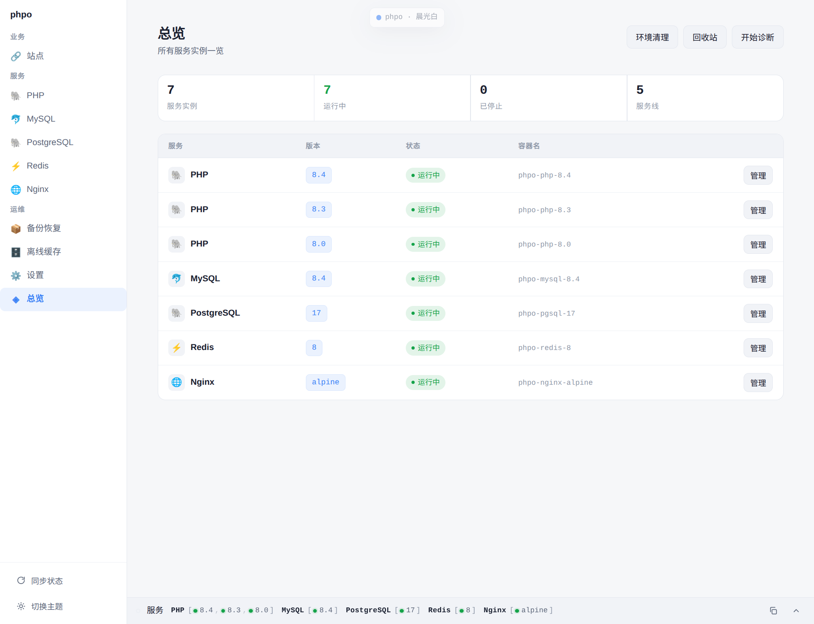

### ② PHP service page: three versions side by side, each managed independently
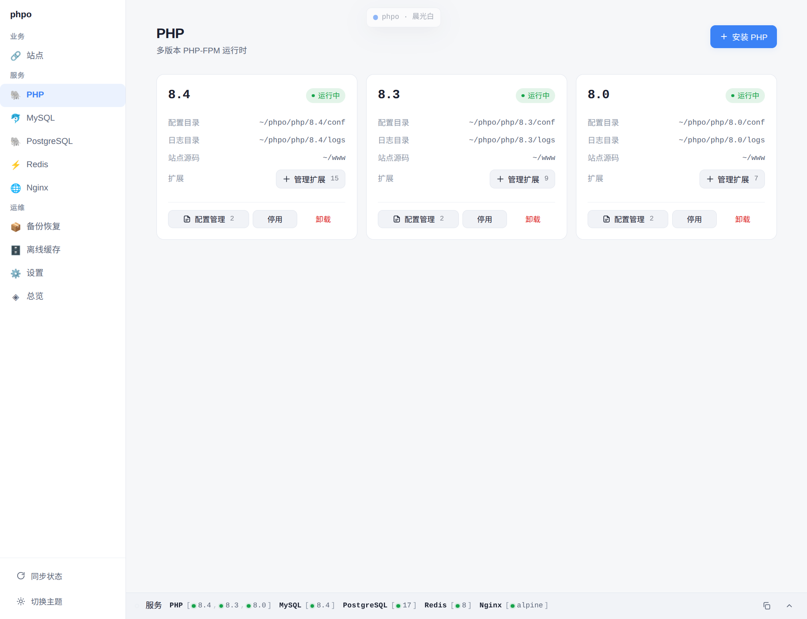

### ③ Site list: port, PHP version, health status, editable inline
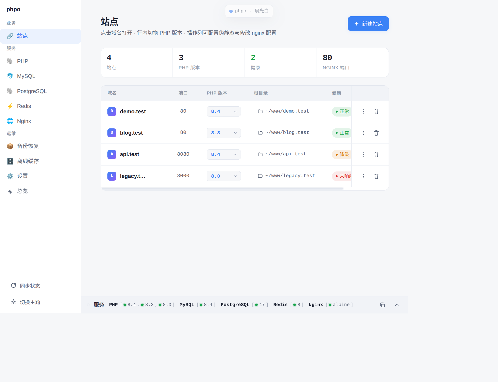

### ④ vhost body: nginx config is directly editable; `nginx -t` before writing to disk
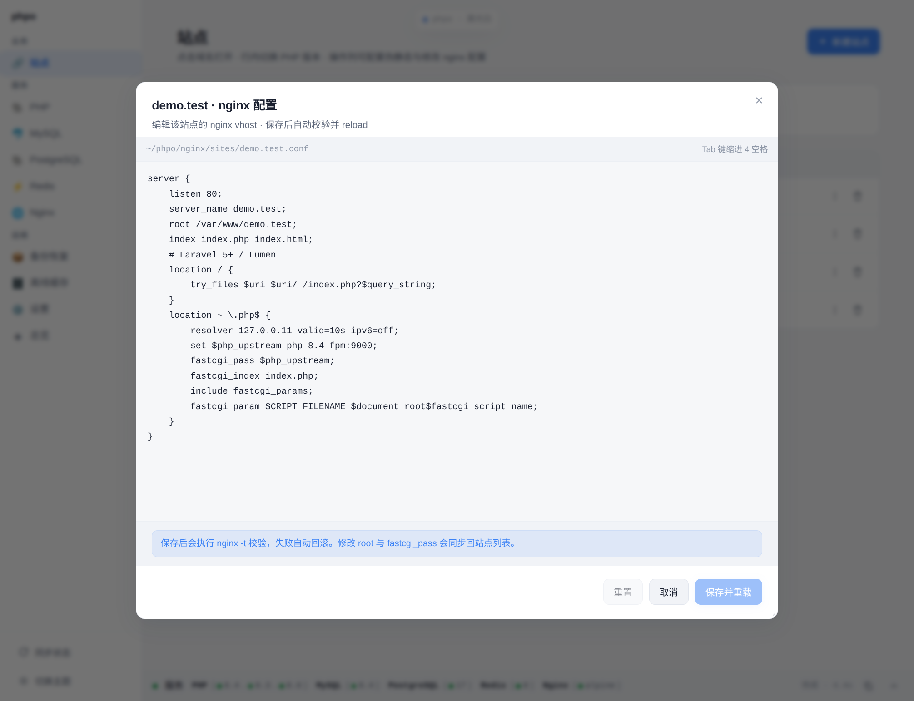

### ⑤ Rewrite rules: 9 framework presets, including those in the Chinese ecosystem
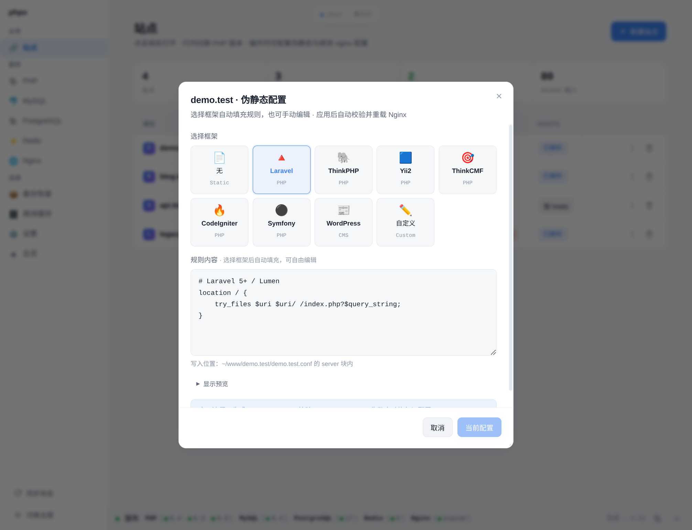

### ⑥ Select extensions when installing PHP: full catalog of 73 items, 11 common ones checked
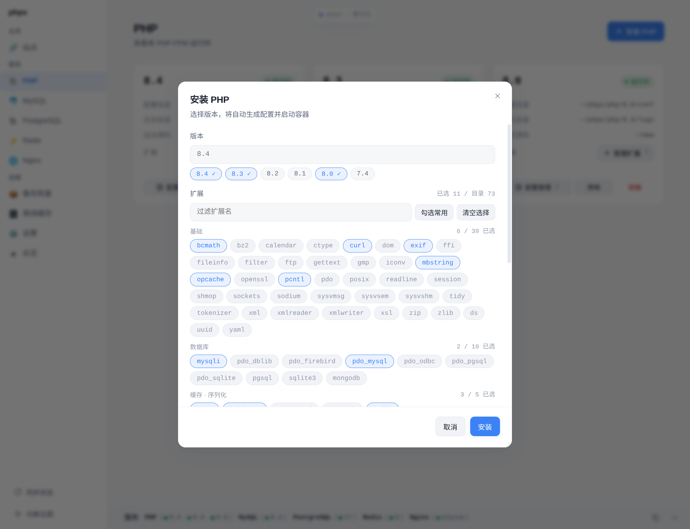

### ⑦ Manage extensions: always submit the complete target set; compilation is streamed line by line
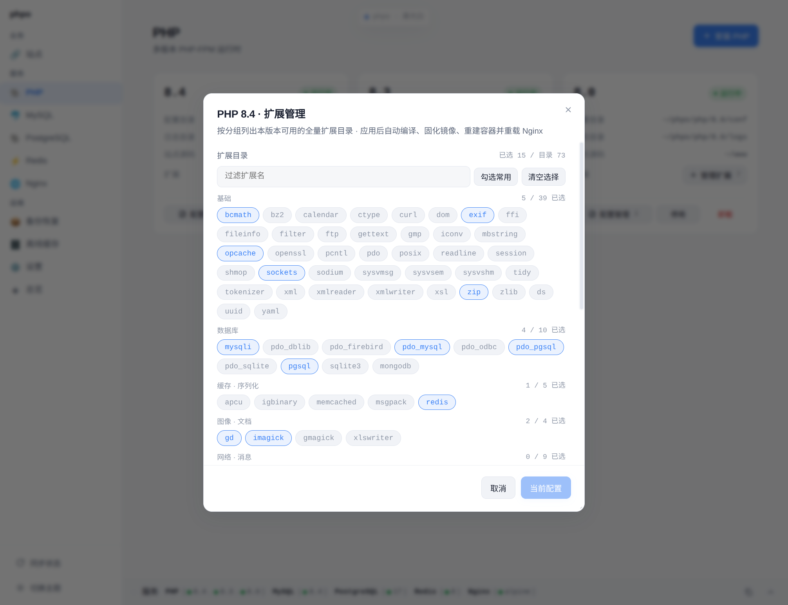

### ⑧ Log drawer: what each step is doing and where it is stuck, written out line by line
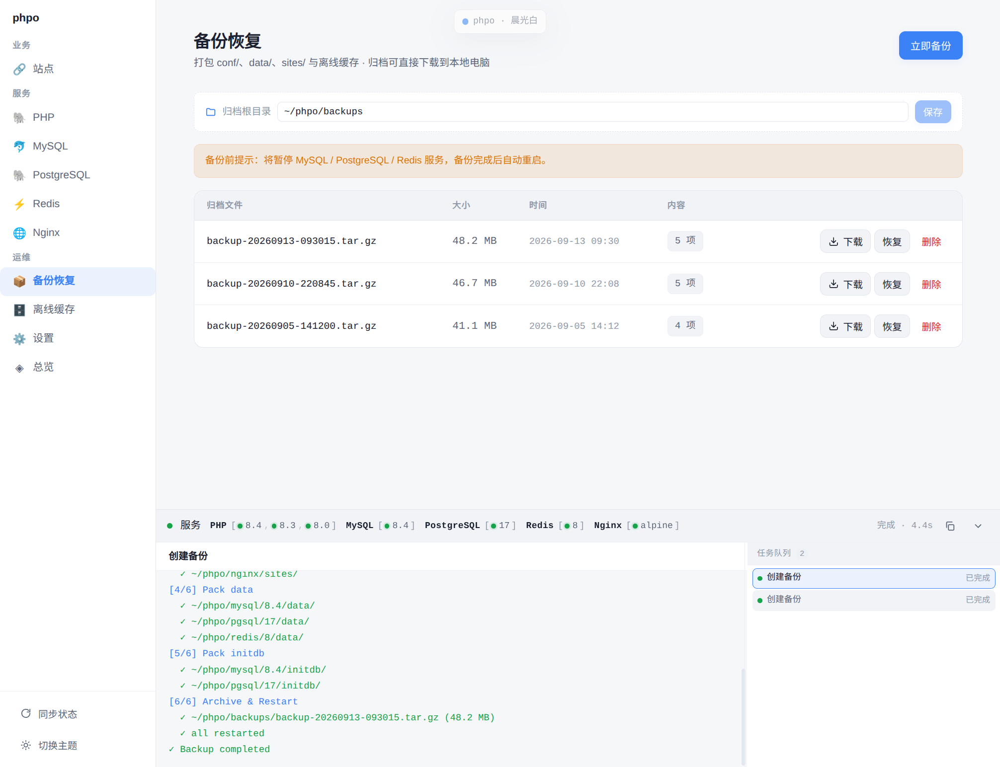

### ⑨ Database service card: port, password, data directory all laid out
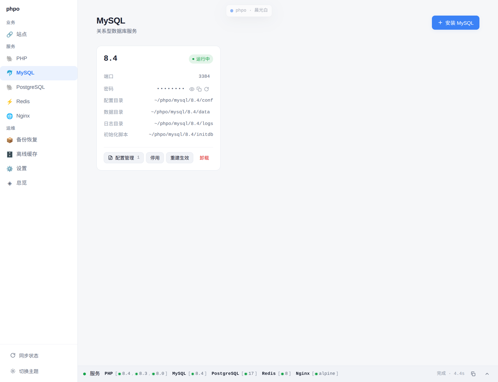

### ⑩ Backup: one-click packaging; unreadable files do not fail the whole archive
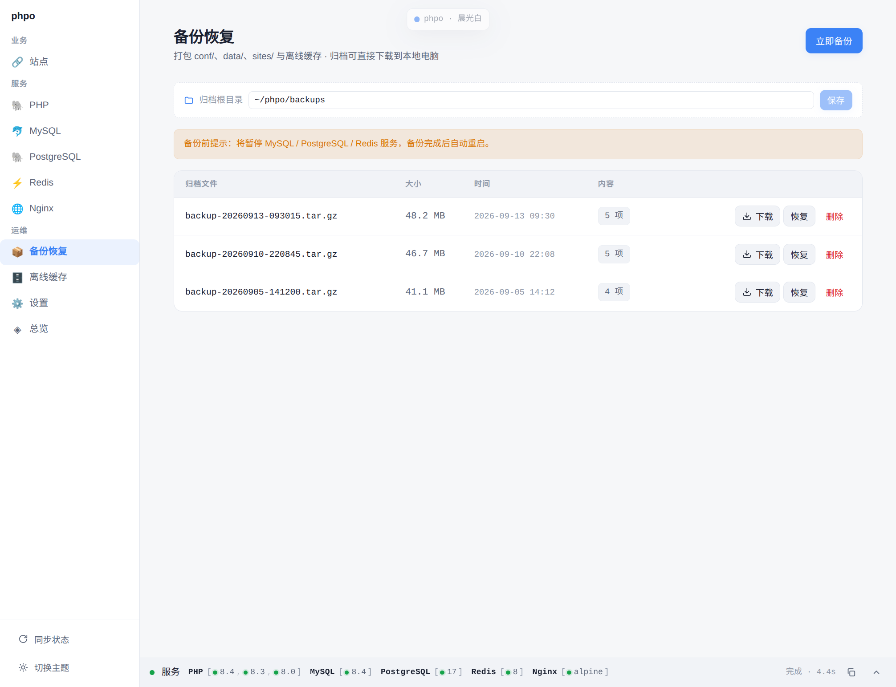

### ⑪ Warning instead of blocking: before stopping a PHP, say clearly who is using it
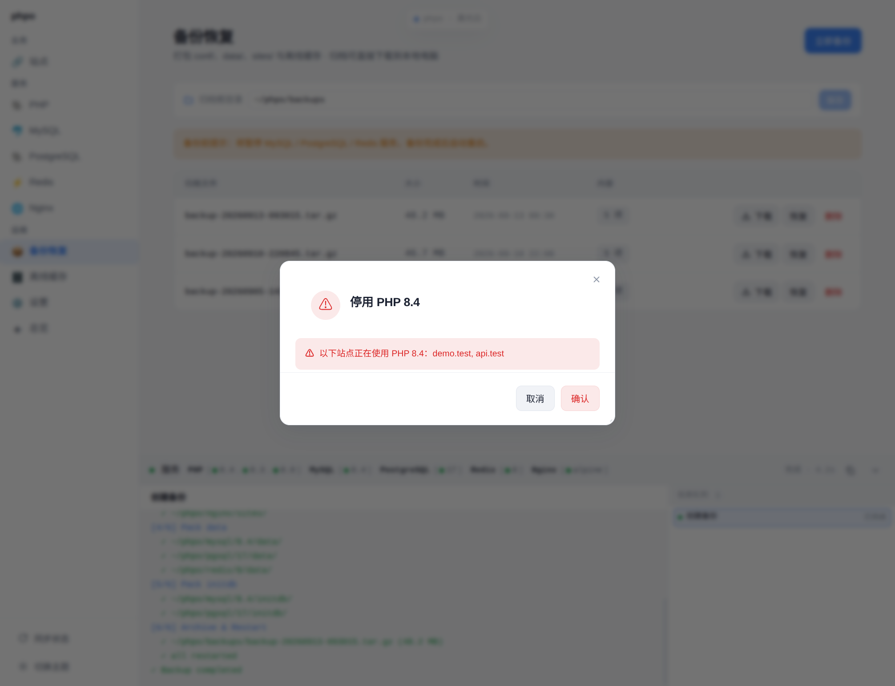

### ⑫ Settings: theme, language, scaling, tray
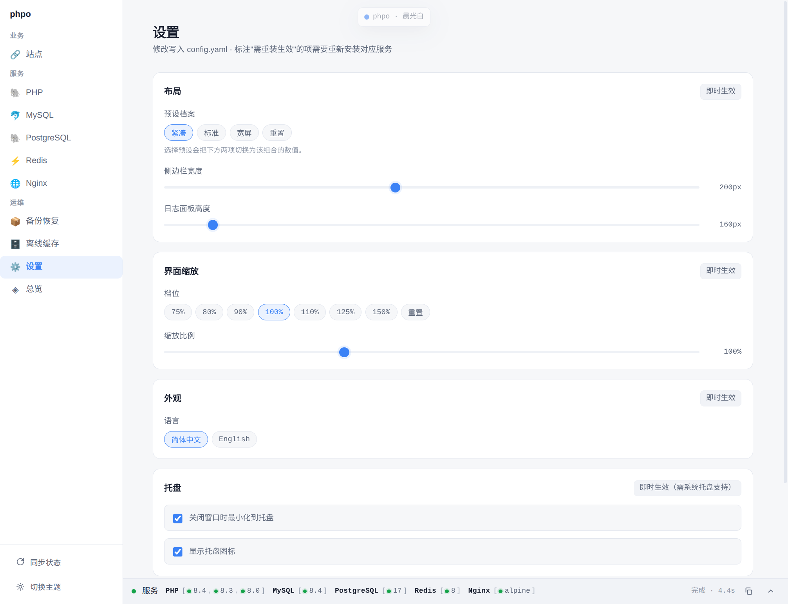

## Install / Run

- Docker must be running; on Linux run `sudo usermod -aG docker $USER` and then re-login.
- First-run wizard: working directory root defaults to `~/phpo`, site root defaults to `~/www`.
- Ten minutes: install PHP 8.3 → install Nginx → create site `demo.test` → open browser → if you need 7.4, install it and switch via dropdown.
- Database default password `123456`, can be empty; after changing password/port, click “Rebuild to take effect”.

## Docs

- `docs/` 32 Chinese articles.
- Read `AGENTS.md` before changing the project.